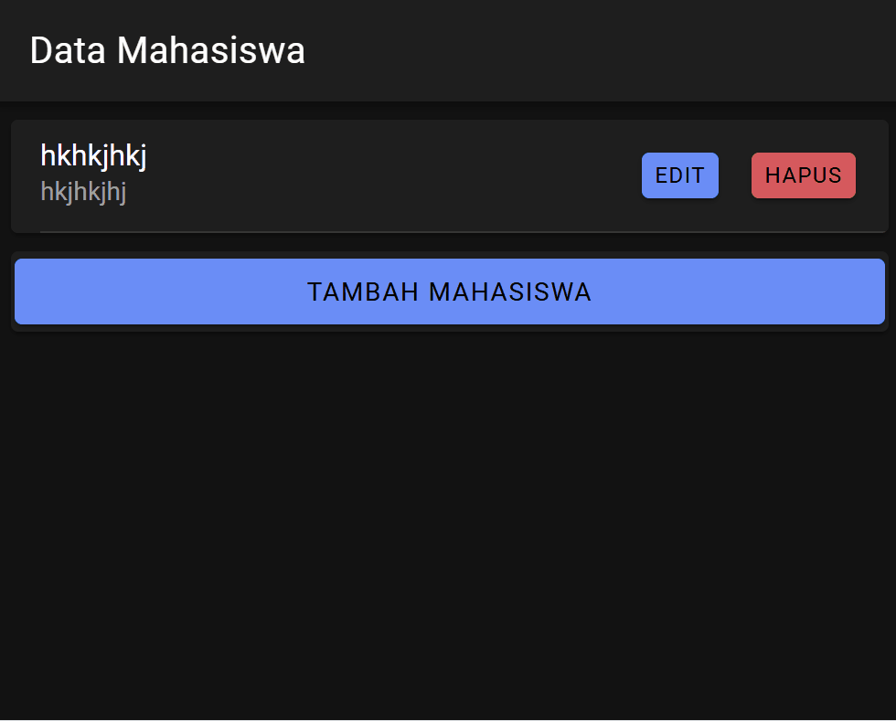

###Jasmine Adzra Fakhirah
H1D022071
Prak Pemob Shift C

Aplikasi CRUD ini mengimplementasikan empat operasi utama pada data mahasiswa (Create, Read, Update, Delete) menggunakan Ionic dan Angular sebagai antarmuka, serta PHP dan MySQL sebagai API dan basis data backend. Proses dimulai dengan Ionic yang berkomunikasi dengan API PHP melalui layanan `api.service.ts`. Untuk **Create** (tambah data), Ionic mengirimkan data mahasiswa baru (nama dan jurusan) ke API PHP melalui endpoint `tambah.php`. PHP menerima data ini, menyimpannya di basis data, dan mengembalikan respons status ke aplikasi Ionic. Untuk **Read** (baca data), aplikasi memuat daftar mahasiswa dari `tampil.php` yang mengembalikan semua data dalam format JSON, lalu ditampilkan di halaman `mahasiswa.page.html`. Dalam **Update** (edit data), pengguna memilih mahasiswa yang ingin diedit, data ini diambil melalui `lihat.php` dan ditampilkan dalam modal edit di Ionic. Setelah diedit, data diperbarui melalui `edit.php` dan respons keberhasilan ditampilkan. Terakhir, **Delete** (hapus data) dilakukan dengan mengirim permintaan ke `hapus.php` yang menghapus data berdasarkan ID mahasiswa dan mengembalikan status keberhasilan. Setiap operasi ini memberikan umpan balik ke Ionic, yang kemudian memperbarui tampilan sesuai hasil operasi, memastikan pengguna selalu melihat data terbaru.